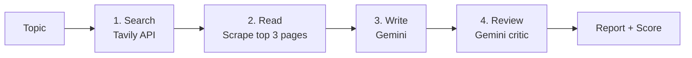

# 🔎 ResearchAI

**A multi-step AI research assistant that turns a single topic into a sourced research report, then critiques its own work.**

Type a topic, and ResearchAI searches the web, reads the best sources, writes a structured article with Google Gemini, and has a second AI "critic" score the result against the research.

---

## ✨ Features

- **Web search** with Tavily to find recent, relevant sources
- **Parallel scraping** of the top 3 pages for full-text context
- **Grounded report writing:** Gemini writes only from the research gathered, with sources listed
- **AI critic review:** scores the report out of 10, with strengths, weaknesses and suggestions
- **Live progress:** each step shows its own status and timing
- **Rate-limit handling:** reads the API's retry delay, shows a countdown and retries automatically
- **Session history** of past reports in the sidebar
- **Downloads** of the report alone, or the full bundle with the critique and raw sources, as Markdown

---

## ⚙️ How it works



| Step | What happens | Uses an LLM? |
|---|---|---|
| **Search** | Queries Tavily and keeps the top 6 results (title, URL, snippet) | No |
| **Read** | Scrapes the top 3 URLs in parallel with BeautifulSoup | No |
| **Write** | Gemini drafts an article: introduction, main content, conclusion, sources | Yes |
| **Review** | Gemini critiques the article against the research and scores it | Yes |

**Design note:** early versions used LLM agents for searching and reading too. That meant about 8 model calls per run and constant rate-limit errors on Gemini's free tier. Moving those steps to plain code cut it to **2 calls per run**, making the app faster, cheaper and more reliable.

---

## 🛠️ Tech stack

- **Python 3.11+**
- **LangChain:** prompt templates and model chains
- **Google Gemini:** report writing and critique
- **Tavily:** web search API built for AI apps
- **BeautifulSoup + Requests:** web page text extraction
- **Streamlit:** web interface

---

## 📁 Project structure

```
research-ai/
├── app.py            # Streamlit web interface
├── pipeline.py       # The four steps, retry logic, and CLI entry point
├── agents.py         # Gemini model setup, rate limiter, writer and critic prompts
├── tools.py          # Web search and scraping functions
├── requirements.txt
├── .env.example      # Template for your API keys
└── README.md
```

---

## 🚀 Getting started

### 1. Clone the repo

```bash
git clone https://github.com/<your-username>/research-ai.git
cd research-ai
```

### 2. Create a virtual environment

```bash
python -m venv .venv

# Windows
.venv\Scripts\activate

# macOS / Linux
source .venv/bin/activate
```

### 3. Install dependencies

```bash
pip install -r requirements.txt
```

### 4. Add your API keys

Create a `.env` file in the project root:

```env
GEMINI_API_KEY=your-gemini-key
TAVILY_API_KEY=your-tavily-key
```

- Gemini key: [Google AI Studio](https://aistudio.google.com/)
- Tavily key: [tavily.com](https://tavily.com/)

### 5. Run it

**Web app:**

```bash
streamlit run app.py
```

**Command line:**

```bash
python pipeline.py
```

---

## 🔧 Configuration

These optional settings go in `.env`:

| Variable | Default | Purpose |
|---|---|---|
| `GEMINI_MODEL` | `gemini-3.6-flash` | Which Gemini model to use |
| `GEMINI_RPM` | `4` | Max Gemini requests per minute. Keep it under 5 on the free tier; raise it if billing is enabled. |

Pipeline settings (`MAX_SOURCES`, `SCRAPE_TOP`, `MAX_ATTEMPTS`) are at the top of `pipeline.py`.

---

## ☁️ Deployment

The app deploys to [Streamlit Community Cloud](https://share.streamlit.io):

1. Push the repo to GitHub, making sure `.env` is in `.gitignore`.
2. Create a new app on Streamlit Cloud and point it at `app.py`.
3. Add `GEMINI_API_KEY` and `TAVILY_API_KEY` under **Advanced settings → Secrets**.

---

## 🗺️ Roadmap

- [ ] Revision loop: the writer automatically improves drafts the critic scores below 7
- [ ] Inline citations mapped to each source
- [ ] Query planning: split a topic into sub-questions for broader coverage
- [ ] Streaming report output
- [ ] PDF and Word export
- [ ] Chat with the report using the scraped sources

---

## 🙏 Acknowledgements

<!-- If you built this from a tutorial, credit it here, e.g.: -->
<!-- Inspired by [creator name]'s tutorial: [link]. Extended with parallel scraping, rate-limit handling, and a redesigned Streamlit UI. -->

---

## 👩‍💻 Author

**KANAN**

- Linkedin--[https://www.linkedin.com/in/kananbehl](#) 
- Github -- [https://github.com/kananbehl123](#)
